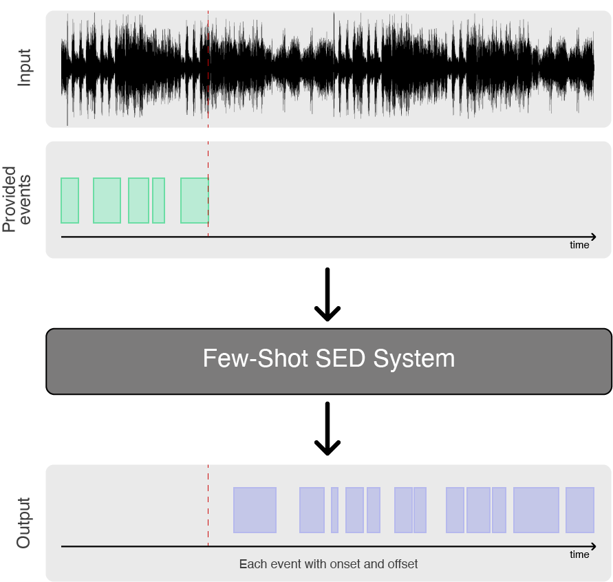
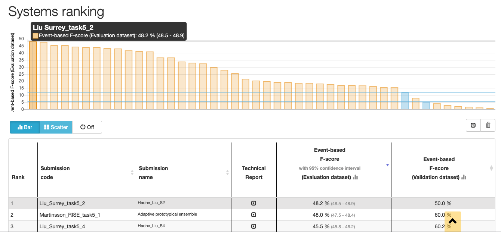
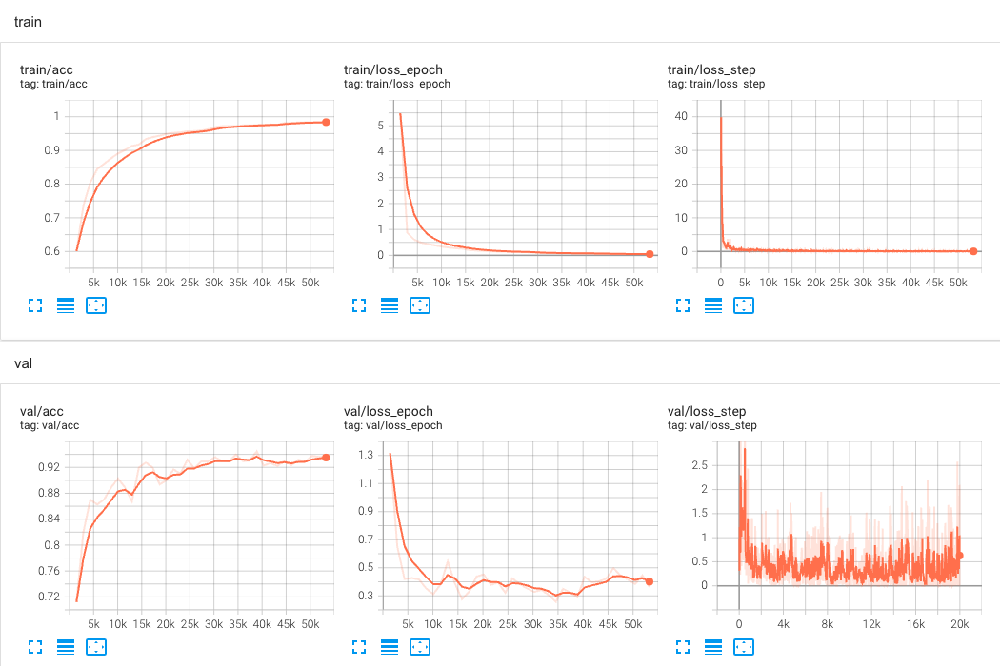

# Few-shot bio-acoustic detection

**Few-shot learning is a highly promising paradigm for sound event detection. It is also an extremely good fit to the needs of users in bioacoustics, in which increasingly large acoustic datasets commonly need to be labelled for events of an identified category** (e.g. species or call-type), even though this category might not be known in other datasets or have any yet-known label. While satisfying user needs, this will also benchmark few-shot learning for the wider domain of sound event detection (SED).

<p align="center"></p>

**Few-shot learning describes tasks in which an algorithm must make predictions given only a few instances of each class, contrary to standard supervised learning paradigm.** The main objective is to find reliable algorithms that are capable of dealing with data sparsity, class imbalance and noisy/busy environments. Few-shot learning is usually studied using N-way-K-shot classification, where N denotes the number of classes and K the number of examples for each class.

> Text in this section is borrowed from [c4dm/dcase-few-shot-bioacoustic](https://github.com/c4dm/dcase-few-shot-bioacoustic)

## Description
This repo is the system I developed for the [DCASE 2022 Challenge task 5 few-shot bio-acoustic detection](https://dcase.community/challenge2021/task-few-shot-bioacoustic-event-detection-results).

|        Method        | Precision (%)  | Recall (%)  | F-measure (%) |
|:--------------------:|:--------------:|:-----------:|:-------------:|
|   [Template Matching](https://github.com/c4dm/dcase-few-shot-bioacoustic/tree/main/baselines/cross_correlation)  |      2.42      |    18.32    |      4.28     |
| [Prototypical Network](https://github.com/c4dm/dcase-few-shot-bioacoustic/tree/main/baselines/deep_learning) |      36.34     |    24.96    |     29.59     |
|       **Proposed**       |      76.28     |    62.56    |     68.74     |

> The performance of prototypical network may be outdated on the validation set. For more information about the prototypical network baseline, please refer to [c4dm/dcase-few-shot-bioacoustic](https://github.com/c4dm/dcase-few-shot-bioacoustic).




> Our system rank 1st in this challenge. For more information about the result please refer to [this link](https://dcase.community/challenge2022/task-few-shot-bioacoustic-event-detection-results).

## How to train from scratch

1. Prepare environment

```bash
# clone project
git clone https://github.com/haoheliu/DCASE_2022_Task_5
cd DCASE_2022_Task_5

# [OPTIONAL] create conda environment
conda env create -f environment.yml 
conda activate dcase_t5
```

2. Prepare training and validation data. Dataset will be automatically downloaded.

```bash
python3 data_preparation.py
```

3. Change the root directory in ./config/train.yaml.

```yaml
path:
  root_dir: <your-root-directory>
#   root_dir: /vol/research/dcase2022/project/t5_open_source/DCASE_2022_Task_5/
```

4. Train model with default configuration. The post-processing and evaluation process will be excuted automatically. 

```bash
# train on CPU
python train.py trainer.gpus=0

# train on GPU
python train.py trainer.gpus=1
```

<!-- ## How to evaluate the pretrained model

```bash
python3 train.py trainer=eval.yaml callbacks=no_early_stop.yaml
``` -->

## Other things

- You can override any parameter from command line like this

```bash
python train.py trainer.max_epochs=20 datamodule.batch_size=64
```

- You can checkout other training options in the train.yaml. 

- System minimum requirement: Memory >= 16GB + A modern CPU/GPU + Free disk space >= 25G.

## Cite this work

```bibtex
@techreport{Liu2022a,
    Author = "Liu, Haohe and Liu, Xubo and Mei, Xinhao and Kong, Qiuqiang and Wang, Wenwu and Plumbley, Mark D",
    title = "SURREY SYSTEM FOR DCASE 2022 TASK 5 : FEW-SHOT BIOACOUSTIC EVENT DETECTION WITH SEGMENT-LEVEL METRIC LEARNING",
    institution = "DCASE2022 Challenge Technical Report",
    year = "2022"
}
```

## Supplementary materials

1. What a normal training look like.



2. The best score I have got on the validation set (with [training log](log.txt) available). But may be our model 'overfit' on this particular test set.
```bash
******************BEST RESULT*****************
BUK1_20181011_001004.wav {'TP': 23, 'FP': 15, 'FN': 8, 'total_n_pos_events': 31}
BUK1_20181013_023504.wav {'TP': 1, 'FP': 2, 'FN': 23, 'total_n_pos_events': 24}
BUK4_20161011_000804.wav {'TP': 0, 'FP': 1, 'FN': 47, 'total_n_pos_events': 47}
BUK4_20171022_004304a.wav {'TP': 14, 'FP': 8, 'FN': 3, 'total_n_pos_events': 17}
BUK5_20161101_002104a.wav {'TP': 51, 'FP': 13, 'FN': 37, 'total_n_pos_events': 88}
BUK5_20180921_015906a.wav {'TP': 0, 'FP': 1, 'FN': 23, 'total_n_pos_events': 23}
ME1.wav {'TP': 8, 'FP': 0, 'FN': 3, 'total_n_pos_events': 11}
ME2.wav {'TP': 36, 'FP': 1, 'FN': 5, 'total_n_pos_events': 41}
R4_cleaned recording_13-10-17.wav {'TP': 19, 'FP': 1, 'FN': 0, 'total_n_pos_events': 19}
R4_cleaned recording_16-10-17.wav {'TP': 28, 'FP': 0, 'FN': 2, 'total_n_pos_events': 30}
R4_cleaned recording_17-10-17.wav {'TP': 34, 'FP': 0, 'FN': 2, 'total_n_pos_events': 36}
R4_cleaned recording_TEL_19-10-17.wav {'TP': 50, 'FP': 2, 'FN': 4, 'total_n_pos_events': 54}
R4_cleaned recording_TEL_20-10-17.wav {'TP': 63, 'FP': 0, 'FN': 1, 'total_n_pos_events': 64}
R4_cleaned recording_TEL_23-10-17.wav {'TP': 84, 'FP': 0, 'FN': 0, 'total_n_pos_events': 84}
R4_cleaned recording_TEL_24-10-17.wav {'TP': 90, 'FP': 7, 'FN': 9, 'total_n_pos_events': 99}
R4_cleaned recording_TEL_25-10-17.wav {'TP': 98, 'FP': 3, 'FN': 1, 'total_n_pos_events': 99}
file_423_487.wav {'TP': 56, 'FP': 0, 'FN': 1, 'total_n_pos_events': 57}
file_97_113.wav {'TP': 47, 'FP': 77, 'FN': 73, 'total_n_pos_events': 120}
{'precision': 0.8263694020113157, 'recall': 0.6085769815815799, 'fmeasure': 70.095, 'precision-avg': 0.8437098989803934, 'recall-avg': 0.6975423280690586, 'fmeasure-avg': 75.484}
```

## Acknowledgement

> This research was partly supported by a PhD scholarship from the Centre for Vision, Speech and Signal Processing (CVSSP), Faculty of Engineering and Physical Science (FEPS), University of Surrey and BBC Research and Development.

> Project structure is borrowed from [lightning-hydra-template](https://github.com/ashleve/lightning-hydra-template). Thanks @ashleve for making such a handful pytorch_lightning template!

